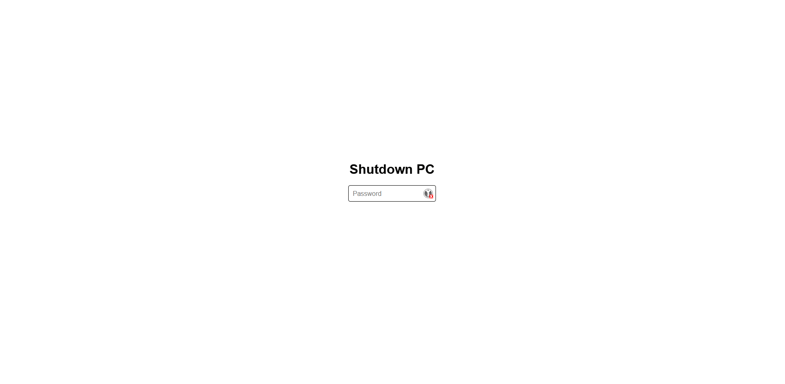

# webShutdown
Allows you to shut down the computer or execute a custom command after entering a password on the graphical user interface.

## Installation
1. [Install](https://github.com/kerogs/webShutdown/releases/latest) and run the installer
2. You can use it!

## Configuration
1. Change value in ``config.ini``. You can found it in ``C:\Program Files\KS-AutoClick``

|Name|Default value|Custom Value|Descrition|
|-|-|-|-|
|debug|``False``|``True / False``|Use only for development|
|local_share|``True``|``True / False``|If enabled, the site will be available on the local network. If not, only the host machine can access it.|
|port|``5113``|Any port|The port to use to access the site, if ``80`` you don't need to write the port.|
|os|``Windows``|``Windows / Linux / Mac``|Command to be used by default to shut down the computer/server (preconfigured command)|
|custom_shutdown|``False``|``False`` or personalized action |Set to False to deactivate, otherwise write the command to be executed directly (automatically deactivates the default command).
|password|``kerogs``|your desired password|Password to be entered in order to perform the action from the website|

### Default command for OS
|OS|Command|
|-|-|
|Windows|``shutdown /s /t 1``|
|Linux|``shutdown now``|
|Mac|``shutdown now``|

## Things that need to be done
- [ ] Enable or disable password prompting
- [ ] Docker compatible